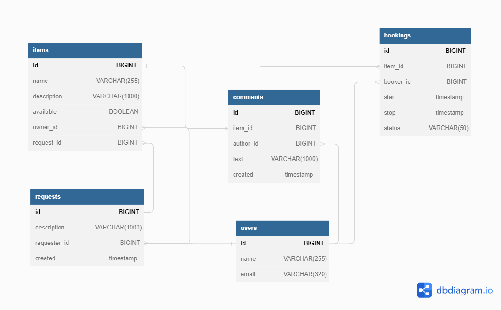

# ShareIt

Сервис для обмена вещами с другими пользователями.
Он даёт пользователям возможность рассказывать, какими вещами они готовы поделиться,
а так же находить нужную вещь и брать её в аренду на какое-то время.

## Стек

* Java 11, Spring Boot, Hibernate, QueryDSL, Lombok, JUnit, PostgreSQL, H2Database, MockMVC, REST API, Maven, Docker

## Архитектура

Сервис состоит из двух модулей:

* ### gateway
    * Получение и валидация запросов пользователя.
    * Отправка полученного запрос на server.
    * Получение ответа от server.
* ### server
    * Добавление/удаление пользователей, обновление данных, удаление.
    * Добавление/удаление/редактирование вещей.
    * Бронировать вещь на определённые даты и закрывает к ней доступ на время бронирования от других желающих.
    * Поиск вещей по названию или описанию, с возможностью фильтрации и постраничной выдачей.
    * Подтверждение или отклонение заявок на аренду владельцем.
    * Создание запроса на вещь, которая отсутствует в приложении.
    * Получение списка всех бронирований пользователя, с возможностью сортировки и фильтрации.
    * Получение списка всех бронирований вещей, принадлежащих пользователю, с возможностью сортировки и фильтрации.
    * Получение списка всех вещей пользователя.
    * Добавление отзыва пользователем на вещь после того, как взял её в аренду.
    * Получение пользователем всех его запросов, с возможностью фильтрации и сортировки.

## Описание API

### User

| HTTP request                           | Method      | Description                   |
|----------------------------------------|-------------|-------------------------------|
| **POST** /users                        | **create**  | Добавление пользователя       |
| **DELETE** /users/{userId}             | **delete**  | Удалить пользователя          |
| **PATCH** /users/{userId}              | **update**  | Обновить данные пользователя  |
| **GET** /users?from={from}&size={size} | **getAll**  | Получить список пользователей |
| **GET** /users/{userId}                | **getById** | Получить данные пользователя  |

### Item

| HTTP request                                                | Method                  | Description                   |
|-------------------------------------------------------------|-------------------------|-------------------------------|
| **POST** /items                                             | **create**              | Добавление вещи               |
| **PATCH** /items/{itemId}                                   | **update**              | Обновить данные вещи          |
| **DELETE** /items/search?text={text}from={from}&size={size} | **search**              | Поиск вещи по значению "text" |
| **POST** /items/{itemId}/comment                            | **createCommentToItem** | Добавление комментария к вещи |
| **GET** /items?from={from}&size={size}                      | **getAll**              | Получить список вещей         |
| **GET** /items/{itemId}                                     | **getById**             | Получить информацию о вещи    |

### Booking

| HTTP request                                                  | Method                    | Description                                            |
|---------------------------------------------------------------|---------------------------|--------------------------------------------------------|
| **POST** /bookings                                            | **bookItem**              | Добавить бронь вещи                                    |
| **PATCH** /bookings/{bookingId}?approved={approved}           | **approve**               | Подтвердить/отклонить бронь                            |
| **GET** /bookings?state={state}&from={from}&size={size}       | **getAllByBooker**        | Получить список вещей забронированных пользователем    |
| **GET** /bookings/owner?state={state}&from={from}&size={size} | **getAllByOwner**         | Получить список забронированных вещей для их владельца |
| **GET** /bookings/{bookingId}                                 | **getBookingByIdForUser** | Получить информацию о брони, созданной пользователем   |

### Request

| HTTP request                                                  | Method                  | Description                                        |
|---------------------------------------------------------------|-------------------------|----------------------------------------------------|
| **POST** /requests                                            | **create**              | Добавить запрос на добавление вещи                 |
| **GET** /requests/all?from={from}&size={size}                 | **getAll**              | Получить список всех запросов пользователя         |
| **GET** /requests/owner?state={state}&from={from}&size={size} | **getAllFromOtherUser** | Получить список всех запросов других пользователей |
| **GET** /requests/{requestId}                                 | **getById**             | Получение информации о запросе                     |

## ER диаграмма

## Дамп БД

- [schema.sql](src/main/resources/schema.sql)

## Docker start-up guide

    mvn clean package
    docker-compose up